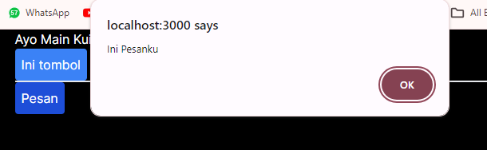
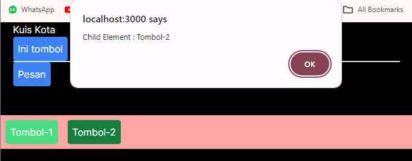
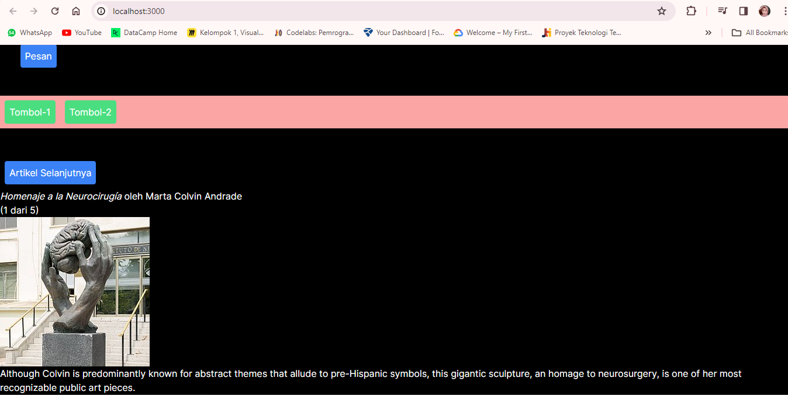

## Laporan Praktikum - Week 4 Pemprograman Framework

This is a [Next.js](https://nextjs.org/) project bootstrapped with [`create-next-app`](https://github.com/vercel/next.js/tree/canary/packages/create-next-app).

## Getting Started

First, run the development server:

```bash
npm run dev
# or
yarn dev
# or
pnpm dev
# or
bun dev
```

Open [http://localhost:3000](http://localhost:3000) with your browser to see the result.

You can start editing the page by modifying `app/page.tsx`. The page auto-updates as you edit the file.

This project uses [`next/font`](https://nextjs.org/docs/basic-features/font-optimization) to automatically optimize and load Inter, a custom Google Font.

## Laporan Praktikum

|  | Pemrograman Berbasis Framework 2024 |
|--|--|
| NIM |  2141720216|
| Nama |  Anisa Rahmasari |
| Kelas | TI - 3A |

## Praktikum 1


## Praktikum 2




## Praktikum 3
Mengklik Tombol-1 akan muncul 2 alert sebagai berikut:


Mengklik Tombol-2 akan muncul 2 alert sebagai berikut:



## Praktikum 4


